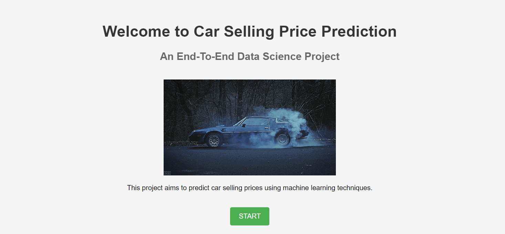
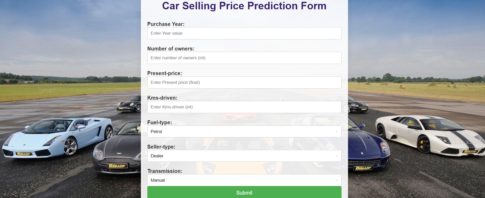

# Car Selling Price Prediction
## END-to-END Machine Learning Pipeline Project

 

 ### Setup in VS Code :

Step 1 : Create a virtual environment

     conda create -p venv python==3.10

Step 2: Create setup.py

Step 3: Create requirements.txt

Step 4: Activate conda environment.

     conda activate "D:\project-1\venv"

Step 5: Create .gitignore file for github.

Step 6: Create src folder

Under src folder create these:

        Component folder
        Pipelines folder
        __init__.py
        exception.py
        logger.py
        utils.py

Step 7 : Create the component python files required:
    
        __init__.py
        data_ingestion.py
        data_transformation.py
        model_trainer.py   

Step 8 : Create the pipeline python files required:
    
        __init__.py
        pred_pipeline.py
        train_pipeline.py
        model_trainer.py   

Step 9: Load dataset from mysql in data folder

Under data folder the dataset will be saved as:

         data.csv

### Deployment:

If you want to view the deployed model, click on the following link: 
Deployed at:
_https://vehicle-price-pred.onrender.com_

• A glimpse of the web app:

